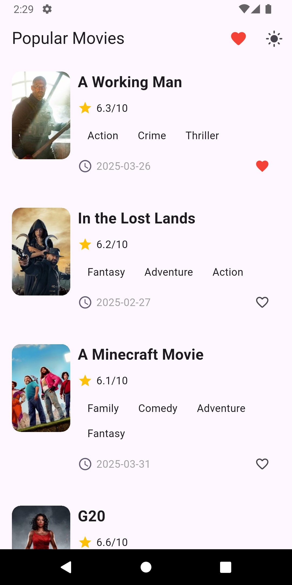
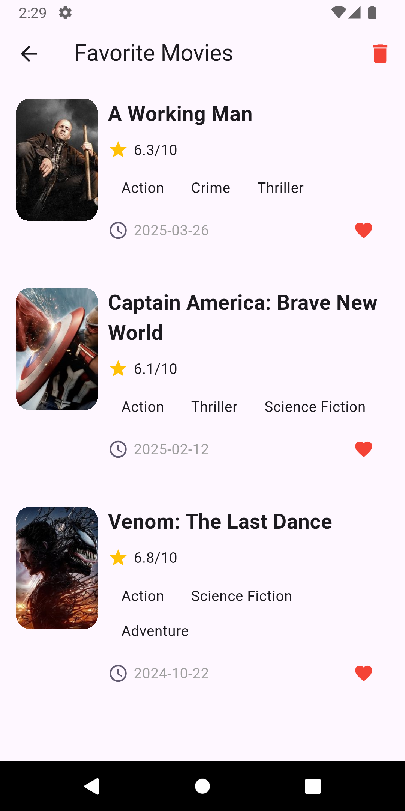
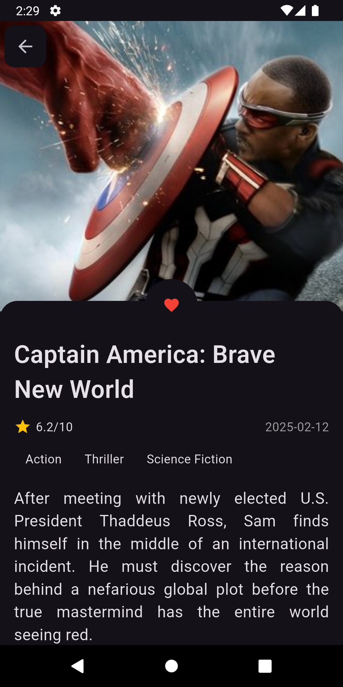
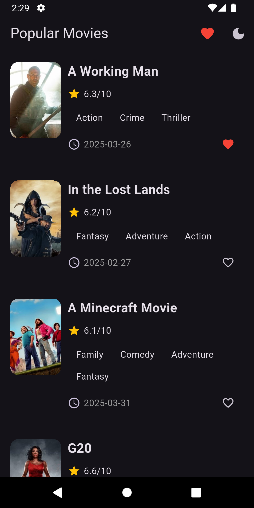

# movies_app_bloc

A Flutter movie application using BloC and GetIt to manage 
state and business logic.

## Getting Started
A Movies API Key and Bearer Token are necessary to be setup in a .env file
that must be created and placed in the assets folder.

# ENV FILE FORMAT  Movies API Key
MOVIES_API_KEY = "moviesapikeyhere"
MOVIES_BEARERTOKEN = "bearertokenhere"

### Features
Using a .env file for environment information for ex. api key
Using real data fetched via an API from TMDB movies database.
Scrollable
Ability to select favorites - red heart -and see favorites for all screens.
Ability to Toggle light and dark theme modes

#### ScreenShots

#### Home Movie Screen Light mode- Full Movie Scrollable List

###  Favorites Screen Light mode - when red heart selected

###  Movie Details Screen 

###  Dark Mode Example when mode toggled

